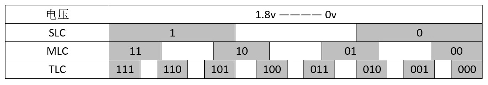

# 写给自己看的固态入门

因为是写给自己看的，所以有些部分就直接复制粘贴了，不转述了。

参考文章：
1. [http://bbs.nga.cn/read.php?tid=8866953&rand=335](http://bbs.nga.cn/read.php?tid=8866953&rand=335)
2. [http://diy.zol.com.cn/561/5614779.html](http://diy.zol.com.cn/561/5614779.html)
## NAND是什么？
NAND本质上是一个电子部件，工作在一定电压范围里。

而在物理世界，电压是连续的，我们需要人为将之划分出若干区间以表达不同的信息。

注意真实世界的区间不是等份的，编码和数据分布也没这么萌呆，更接近于矩阵。
本帖所有的图都是抽象示意，不再赘述。

同样的电压，在SLC里可能表示为1，MLC里表示为10，TLC里就表示为101。
很多时候，同样一片nand，你把它定义为MLC它就是MLC，定义成TLC它就是TLC，对他来说你的写入只是个电压而已。

同理，现在普遍采用的SLC缓存模式也是把NAND当SLC先写上，然后后台再按TLC重写。

## SLC,MLC,TLC,QLC的区别
1. SLC的S指single，指的是1个ceil中只储存1个bit
2. MLC的M指multi，指的是1个ceil中可以储存多个bit。但一般消费者和测评都认为MLC特指1ceil中只储存2个bit。但是也有例外，比如三星在写配置时会标注3bit/ceil的MLC，严格来说也没错，但既然有TLC这个词汇，为什么三星不直接标注是TLC呢？
3. TLC的T指Trinary,即3bit/ceil
4. QLC的Q指Quad，即4bit/ceil

## TLC为什么写入速度慢？
TLC里面每个ceil里存3个bit，因此TLC需要更精密的控制电压，写的次数也更多。

SSD写入操作时更接近矩阵，slc是1x2，mlc是2x2，tlc是3x2。
slc写入需要上电1次；mlc可以选择1到2次写完，两种方式各有利弊；tlc鉴于对电压的精确控制要求极高，只能先写两次，然后校验已写入的内容，最后再写一次。当然这三种最后都要再校验一次。
显然TLC复杂了很多，最终就体现在TLC产品100M+的写入速度上。

## TLC是如何解决写入速度慢的？
### 方法一:SLC Cache，常说的大容量写入掉速
TLC为了提高写入速度，将一部分的ceil中只写入1bit的数据,将一部分的ceil当做SLC使用。

方式也大概分两种,静态规划和动态规划：
1. 一部分SSD会选择划定专属空间来充当SLC Cache，而这部分空间只有当SSD实际使用容量超过SSD本身容量减去SLC Cache之差后，就不再承担SLC Cache缓存义务，重新变成TLC区域，这样做的好处是SLC Cache专属区域只有实际使用容量超过临界值时才会被解散，在绝大多数没有达到临界值时，SLC Cache就可以全部参与为SSD读写加速，当然这样做也有坏处的，这块SLC Cache专属区域由于要面临最多数据量的读写，这块区域的P/E将会更快耗尽（SLC也有P/E）。
2. 另外一部分SSD就选择了全盘动态划分SLC Cache区域，SLC Cache的大小会随着SSD的实际使用容量而变化，这样SLC Cache的空间虽然无法得到保证，但是由于是均衡磨损，也不会对全盘NAND Flash的P/E过分消耗。

## TLC的读取掉速问题
电子是活跃的，电池放着不用会没电，NAND的电压也会逐渐损失。
当电压掉到一定程度，可能就和原来写入时的数据不是一回事了。

比如你存入盘中一个1234，他可能不仅存个1234，还会存个四个数加起来是10，这样数据损坏变成12？4，你还知道？是3。
当然为了存这个“加起来是10”也需要额外的空间，实际写入和原数据的比值，我们称之为写入放大比。之所以企业级产品用着512g的nand制造出400g可用容量的盘，就是为了数据可靠性。
同样是ssd，Intel 730号称盘上坏一片nand都能把数据重建，而200块钱的大号U盘就别指望了。
TLC因为自身特性，更容易漏电导致数据损失，如果损失了进行**重建**，速度就会大受影响，这就是所谓的TLC掉速。

总结TLC掉速是旧数据因为漏电掉速，**只有在几个月甚至更久后去读最近没用过的数据**才会掉速。（重建导致掉速）

厂家怎么解决这个问题？解决方法就是隔一段时间重写一次，牺牲一点寿命。因此TLC为了维持数据需要经常覆盖重写

**反对意见**：所有SSD都有漏电的情况，但是这个反复写入的频率远比你想想的要低的多，TLC真是放着几个月不用电掉光了那就别用了，哪个TLC的U盘是几个月、1年不用就漏电掉数据的？哪个U盘需要读旧数据然后重新写新的？
实际上大概要重复读取几千次以后才需要重新写入一次，实际上可以忽略这个对寿命的影响。 

## 寿命问题
不玩PT，BT做种常年10MB/S，寿命真的不是啥问题。

想玩PT,BT做下载盘，机械盘不好吗？

寿命以PE计算，以总可用容量为标准
固态硬盘之间的比较：
SLC>MLC>TLC

而即使是TLC也有300-400PE，基本上是用不完的。

原因：我想和之前说的写入有关，同一块NAND的ceil为写入3个bit可能要多次上电，而MLC上电次数更少。

## 购买意见(更新于19.4.20)

### 总纲

本购买意见以个人需求为主，定位在普通消费者和轻微发烧友之间，以性价比最高为指导。

### MLC还是TLC？
在QLC出货之前，对绝大多数人来说，TLC都可以买。MLC对于非发烧友根本没必要。

**MLC和TLC的性价比真的只能体现在1GB几块钱上了。**

速度方面：

MLC的速度真的是很快，2300MB/S的读，1500MB/S的写，但是现在的稍微好一点点的TLC基本也能读，写500MB/S了，足够满足日常需求了。

寿命方面：

之前说了TLC的500PE，你用的完吗？

所以，对**普通消费者**来说，MLC和TLC的性价比真的只能体现在1GB几块钱上了。

### 质保一年，三年还是五年？

一年很少见，也不太推荐一年质保。不实惠。因为真的1.5年后出现问题了，你就只能自认倒霉了。

三年质保已经足够。

从换新的角度来说，可以考虑新的性价比之王。比如现在是19年4月，QLC快出了，很可能固态市场的格局很快又不太一样。

从质量的角度来说，3年内不出问题，基本之后也没啥问题。基本再坏就是老化的问题。再用个几年，主控老化，PE还没到，可能就寿终正寝了。

五年和三年的结论差不多，可必要，也没必要。五年质保的盘也不多。

P.S.从换保的角度来说，可能是有骚操作的，比如质保期内，经情放纵，把自己的SSD当做BT下载盘疯狂读写，质保期内坏掉再换保。不过这有个难点：你得保证质保期内能被你用坏（23333）。这样做唯一的好处是使得自己的下载盘拷贝时更快，平时用的更爽一些。

### 一分钱一分货
这个道理是个人就知道。

杂牌和超便宜的TLC SSD就算了，就是一个大U盘。

但是太便宜的车总是有，上车前还是多问问，为啥这车这么便宜？如果是有质量问题就不要上了，买个大U盘当做SSD用，总是不舒服的。

### 容量选择
SSD容量也来越大，其中TLC的大小比较重要。因为TLC越大，模拟SLC缓存的部分越大，使用起来写性能更好，掉速基本察觉不到。考虑到现在游戏越大，电影也越大，SSD也越来越便宜，推荐买大一些的SSD。

电脑可以配一个512G的SSD+机械
也可以直接考虑直接上1T，不要机械，价格也能接受。

更大的性价比就大打折扣了。

### 市场预测

SSD还会降，因为QLC就要来了！
（TLC终于有一个可以鄙视的对象了）

### 品牌推荐选择时间(写不下去了，我不会)

#### 三星
三星在价格方面17年的大涨‘功不可没’，虽然很不喜欢三星，但是目前来看，当前的性价比之王确实是三星的PM981。其中512G某宝仅售488，1G不到一块钱，读写性能都相当可以。三年质保（只有店保，大概意思是PM和SM系列，三星是不在国内出售的，因此消费者要保修，只能通过TB店的承诺，来进行保修。一般大店都是保的，自己记得长个心眼，买之前和客服沟通）

##### PM和SM系列

如上所述PM和SM都是不能直接找三星售后保的，只能店保。

三星的PM系列都是TLC的

三星的SM系列都是MLC的

